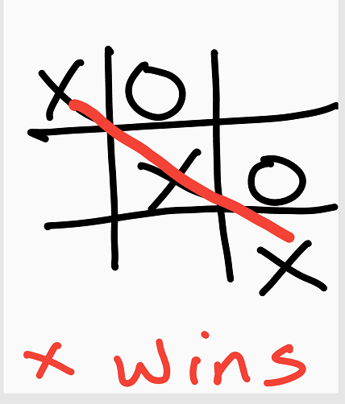

# Tic-Tac-Toe Game
The goal of this game is to get 3 of the same symbol (either X or O) to align uninterrupted by another symbol either vertically, horizontally or diagonally on the board in order to win as shown below.

The user interface of the game looks like this:

Step 1 : Start the game by typing bin/main.rb in terminal

Step 2: Key in the names of just two players choosing either X or O symbols to play

Step 3: For each player, just key in the box number of where you want to place your symbol.
Continue until prompted a winner or a draw!

## Built With
- Ruby

## Live Demo

👤 **Authors**

***Joseph Mindo***
- Github: [@MindoJoseph](https://github.com/Mindo-Joseph)
- Twitter: [@mindoJoseph](https://twitter.com/mindoJoseph)
- Linkedin: [Joseph Mindo](https://www.linkedin.com/in/joseph-mindo-367284132/)
- Mail: mindo.joseph.mj@gmail.com

***Kossy Steve***
- Github: [@KossySteve](https://github.com/KossySteve)
- Twitter: [@EzeSteve3](https://twitter.com/EzeSteve3/)
- Linkedin: [linkedin](https://www.linkedin.com/in/steve-ez-b090ba198/) 
- Mail: kossyeze@gmail.com
## 🤝 Contributing

Contributions, issues and feature requests are welcome!

Feel free to check the [issues page](https://github.com/KossySteve/TicTac-Toe/issues).

## Show your support

Give a ⭐️ if you like this project!
