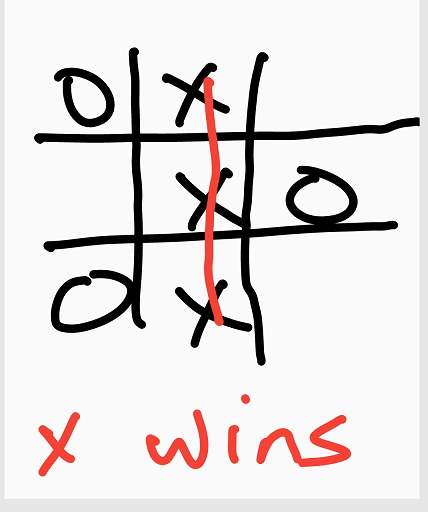
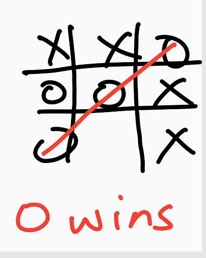
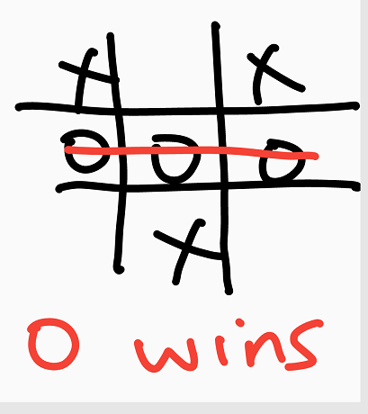

# Tic-Tac-Toe Game
This game is a CLI application built with Ruby. The goal of this game is to get 3 of the same symbol (either X or O) to align uninterrupted by another symbol either vertically, horizontally or diagonally on the board in order to win as shown below.

# How To Play?

# On replit?
Step 1: click the play link in step 9 below

Step 2: click on the console tab

Step 3: The first player inputs name and chooses either X or O symbols to play

Step 4: The second player inputs name and automatically gets a symbol either X or O different from first player's symbol

Step 5: The first player should key in the particular box number to place your symbol to play and wait for second player to play.

Step 6: The second player should key in the particular box number to place your symbol to play.

Step 7: The first player can play again. This continues until a player wins or game ends as a draw!

Step 8: If players want to play again the should input Yes or Y, if not thanks for playing.

Step 9: CLICK HERE TO PLAY!!! (https://replit.com/@kossySteve/TicTac-Toe-1#.replit)

# In terminal?
Step 1 : Start the game by typing bin/main.rb in terminal

Next steps : same as steps 2 - 8 above

# GAME UI?
The user interface of the game looks like this:

Step 1 :

Step 2:

Step 3:

Step 4:

Step 5: 

Step 6:

Step 7:

## Built With
- Ruby

## Live Demo

👤 **Authors**

***Joseph Mindo***
- Github: [@MindoJoseph](https://github.com/Mindo-Joseph)
- Twitter: [@mindoJoseph](https://twitter.com/mindoJoseph)
- Linkedin: [Joseph Mindo](https://www.linkedin.com/in/joseph-mindo-367284132/)
- Mail: mindo.joseph.mj@gmail.com

***Kossy Steve***
- Github: [@KossySteve](https://github.com/KossySteve)
- Twitter: [@EzeSteve3](https://twitter.com/EzeSteve3/)
- Linkedin: [Kossy Steve](https://www.linkedin.com/in/kossy-steve/) 
- Mail: kossyeze@gmail.com
## 🤝 Contributing

Contributions, issues and feature requests are welcome!

Feel free to check the [issues page](https://github.com/KossySteve/TicTac-Toe/issues).

## Show your support

Give a ⭐️ if you like this project!
